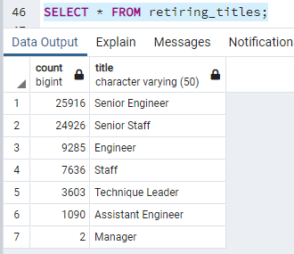

# Overview of the analysis
Bobby's tasks were to determine the number of retiring employees per title and identify employees who are eligible to participate in a mentorship program.
He needs to help his manager understand "Silver Tsunami" is coming as many current employees are reaching their retirement age.

# Results 

* There is more than 70,000 employees by their most recent job title who are about to retire: 
* 72,458 

# Summary

* How many roles will need to be filled as the "silver tsunami" begins to make an impact?
* Are there enough qualified, retirement-ready employees in the departments to mentor the next generation of Pewlett Hackard employees?
