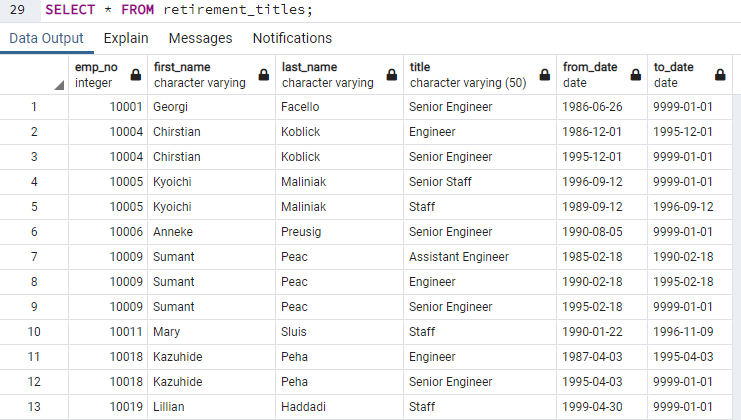
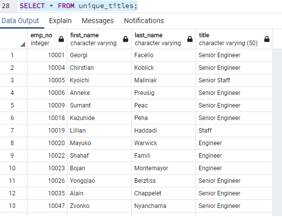
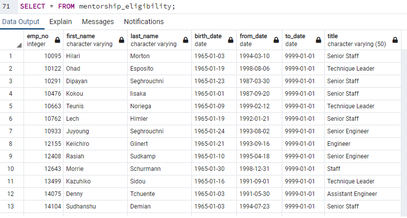

# Overview of the analysis
Bobby's tasks were to determine the number of retiring employees per title and identify employees who are eligible to participate in a mentorship program.
He needs to help his manager understand "Silver Tsunami" is coming as many current employees are reaching their retirement age.

# Results 

* When you look at the retirement titles table, there are a lot of employees with duplicated titles. 
  * For example, employee number 10004 Chirstian Koblick has 2 titles (Engineer and Senior Engineer). But the information for his from_date and to_date are not the same. 

* So Bobby had to get the table that shows the employees with unique titles.
  * Now the information is more clean with "most recent job titles"

* Then, Bobby could retrieve the number of employees by their most recent job title who are about to retire. 
  * There are more than 70,000 employees by their most recent job title who are about to retire: 72,458 

* Now, Bobby was able to retrieve the employees eligible for the mentorship program.
  * Retrieved the information by filtering the employees to current employees and the birth date to the year of 1965: 
  * Total of 1,549 employees

# Summary

### How many roles will need to be filled as the "silver tsunami" begins to make an impact?
72,458 roles will be retiring so we need to fill as many as 70,000 roles. 

### Are there enough qualified, retirement-ready employees in the departments to mentor the next generation of Pewlett Hackard employees?
There are not enough qualified, retirement-ready employees. We only have 1,529 employees who are eligible to join the mentorship program.
